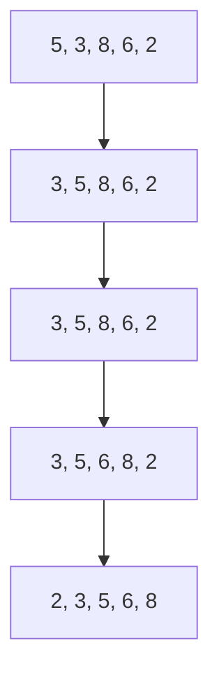

# DAA Repository

Welcome to the **DAA Repository**! This repository is a collection of codes, algorithms, and notes related to the **Design and Analysis of Algorithms (DAA)** course. It aims to serve as a comprehensive resource for learning and revising key concepts in DAA.

---

## Features

- 📚 **Well-Documented Codes**: Each algorithm is thoroughly documented with explanations.
- 🧪 **Test Cases**: Every code includes test cases to validate correctness.
- 🚀 **Optimized Solutions**: Focused on writing efficient and clean code.
- 📂 **Organized Structure**: All files are categorized for easy navigation.

---

## Contents

1. **Sorting Algorithms**
   - Bubble Sort
   - Merge Sort
   - Quick Sort

2. **Searching Algorithms**
   - Binary Search
   - Linear Search

3. **Graph Algorithms**
   - Dijkstra's Algorithm
   - Floyd-Warshall Algorithm

4. **Dynamic Programming**
   - Longest Common Subsequence (LCS)
   - 0/1 Knapsack Problem

5. **Greedy Algorithms**
   - Huffman Encoding
   - Kruskal's Algorithm

6. **Divide and Conquer**
   - Strassen's Matrix Multiplication
   - Closest Pair of Points

---

# Insertion Sort Algorithm

## Introduction
Insertion Sort is a simple and efficient **comparison-based sorting algorithm**. It works similarly to how we sort playing cards in our hands. The algorithm builds the sorted list one element at a time by **inserting** each element into its correct position.

---

## Algorithm Steps
1. Assume the first element is already sorted.
2. Pick the next element and compare it with elements in the sorted part.
3. Shift elements to the right until the correct position for the current element is found.
4. Insert the element at its correct position.
5. Repeat for all elements.

---

## Pseudocode
```plaintext
InsertionSort(A, n)
1. for i = 1 to n-1
2.     key = A[i]
3.     j = i - 1
4.     while j >= 0 and A[j] > key
5.         A[j + 1] = A[j]
6.         j = j - 1
7.     A[j + 1] = key

```



---


## Contribution Guidelines

Contributions are welcome! Please follow these steps:

1. Fork this repository.
2. Create a new branch: `git checkout -b feature-name`.
3. Commit your changes: `git commit -m 'Add a new feature'`.
4. Push to the branch: `git push origin feature-name`.
5. Open a pull request.

---

## Contact

- **GitHub Profile**: [uroy80](https://github.com/uroy80)
- **Email**: ushamroy80@gmail.com

---

### Happy Coding! 😊
