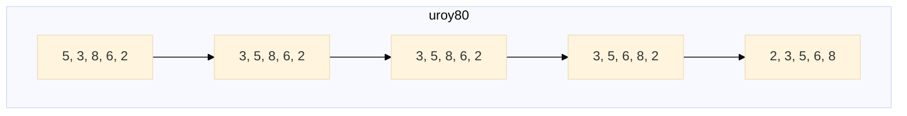
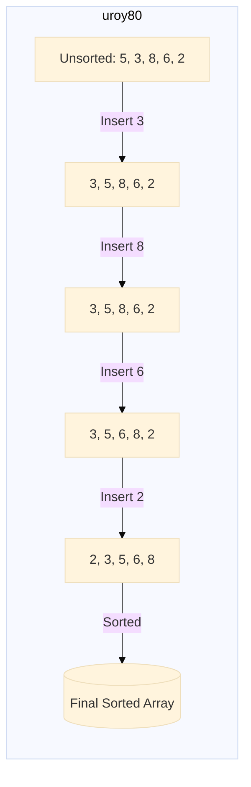

# DAA Repository

Welcome to the **DAA Repository**! This repository is a collection of codes, algorithms, and notes related to the **Design and Analysis of Algorithms (DAA)** course. It aims to serve as a comprehensive resource for learning and revising key concepts in DAA.

---

## Features

- 📚 **Well-Documented Codes**: Each algorithm is thoroughly documented with explanations.
- 🧪 **Test Cases**: Every code includes test cases to validate correctness.
- 🚀 **Optimized Solutions**: Focused on writing efficient and clean code.
- 📂 **Organized Structure**: All files are categorized for easy navigation.

---

## Contents

1. **Sorting Algorithms**
   - Bubble Sort
   - Merge Sort
   - Quick Sort
   - Insertion Sort (New)

2. **Searching Algorithms**
   - Binary Search
   - Linear Search

3. **Graph Algorithms**
   - Dijkstra's Algorithm
   - Floyd-Warshall Algorithm

4. **Dynamic Programming**
   - Longest Common Subsequence (LCS)
   - 0/1 Knapsack Problem

5. **Greedy Algorithms**
   - Huffman Encoding
   - Kruskal's Algorithm

6. **Divide and Conquer**
   - Strassen's Matrix Multiplication
   - Closest Pair of Points

---

## 📌 Chapter: Insertion Sort

### **Introduction**
Insertion Sort is a simple and efficient comparison-based sorting algorithm that builds the final sorted array one element at a time.

### **Algorithm**
1. Iterate from index `1` to `n-1`.
2. Compare the current element with its predecessors.
3. Shift elements to the right to make space for the correct position of the current element.
4. Repeat until the array is sorted.

### **Pseudo Code**

```plaintext
for(i=1;i<size;i++)
{
   temp=list[i];
      j=i-1;
   while((temp<list[j]) && (j>=0))
   {
      list[j+1]=list[j];
         j=j-1;
   }
} list[j+1]=temp;
```
### **Code Implementation in C**
```c
#include <stdio.h>

void insertionSort(int arr[], int n) {
    for (int i = 1; i < n; i++) {
        int key = arr[i];
        int j = i - 1;
        while (j >= 0 && arr[j] > key) {
            arr[j + 1] = arr[j];
            j--;
        }
        arr[j + 1] = key;
    }
}

void printArray(int arr[], int n) {
    for (int i = 0; i < n; i++) {
        printf("%d ", arr[i]);
    }
    printf("\n");
}

int main() {
    int arr[] = {5, 3, 8, 6, 2};
    int n = sizeof(arr) / sizeof(arr[0]);
    insertionSort(arr, n);
    printArray(arr, n);
    return 0;
}
```

### **Time Complexity Analysis**
- **Best Case (`O(n)`)**: Already sorted array.
- **Worst Case (`O(n²)`)**: Reverse sorted array.
- **Average Case (`O(n²)`)**: Random order.

### **Advantages**
✔ Efficient for small data sets.

✔ Simple and easy to implement.

✔ Stable sorting algorithm (preserves the order of equal elements).

### **Disadvantages**
✖ Not suitable for large data sets due to `O(n²)` complexity.

✖ Inefficient compared to Quick Sort and Merge Sort.

### **Applications**
📌 **Used in small databases where simplicity matters.**

📌 **Effective for nearly sorted data (adaptive sorting).**

📌 **Used in educational purposes to teach sorting concepts.**

### **Visualization Using Mermaid.js**




---

## Contribution Guidelines

Contributions are welcome! Please follow these steps:

1. Fork this repository.
2. Create a new branch: `git checkout -b feature-name`.
3. Commit your changes: `git commit -m 'Add a new feature'`.
4. Push to the branch: `git push origin feature-name`.
5. Open a pull request.

---

## Contact

- **GitHub Profile**: [uroy80](https://github.com/uroy80)
- **Email**: ushamroy80@gmail.com

---

### Happy Coding! 😊
